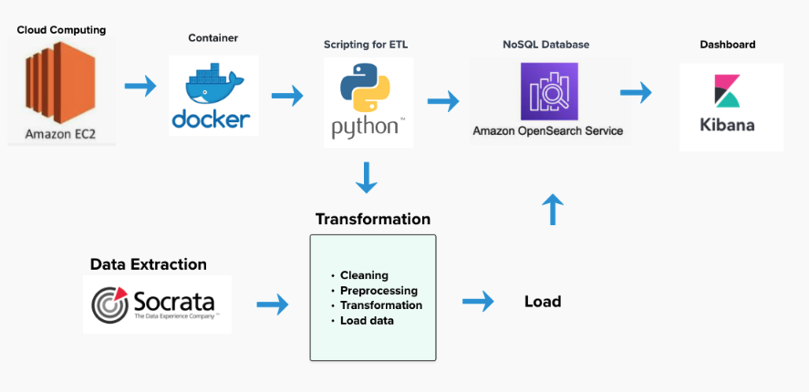
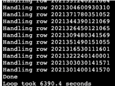
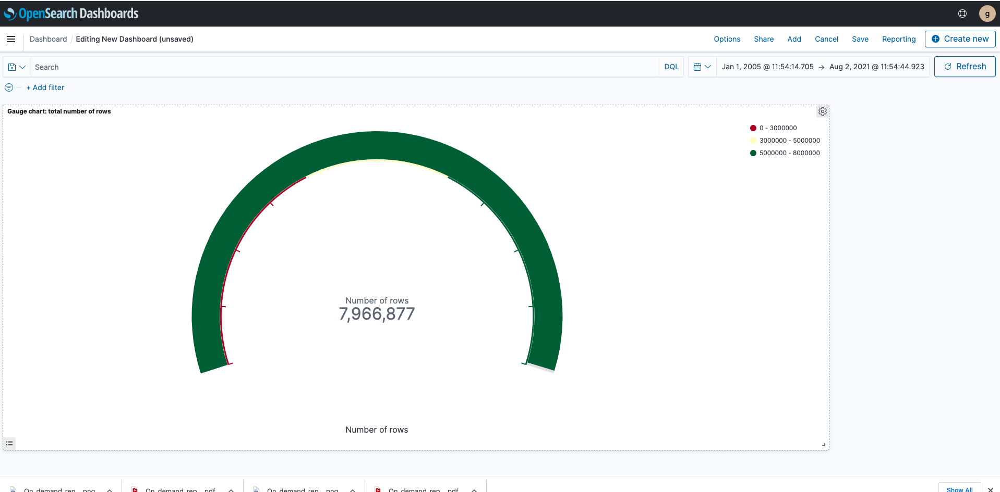
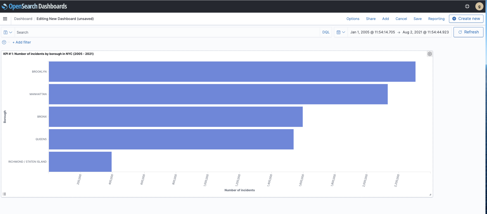
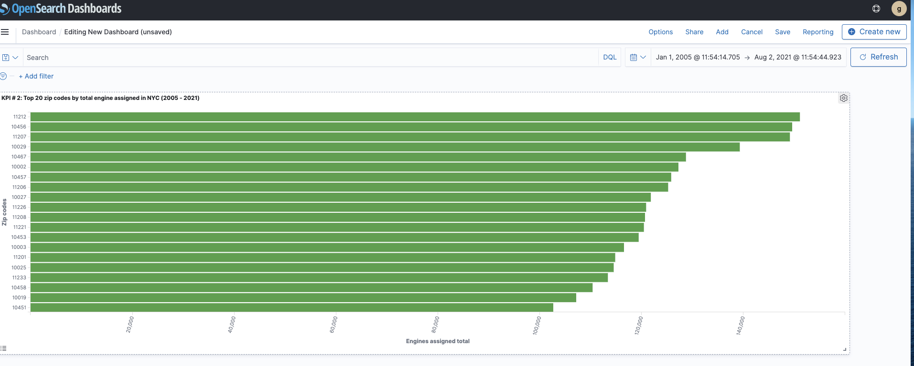
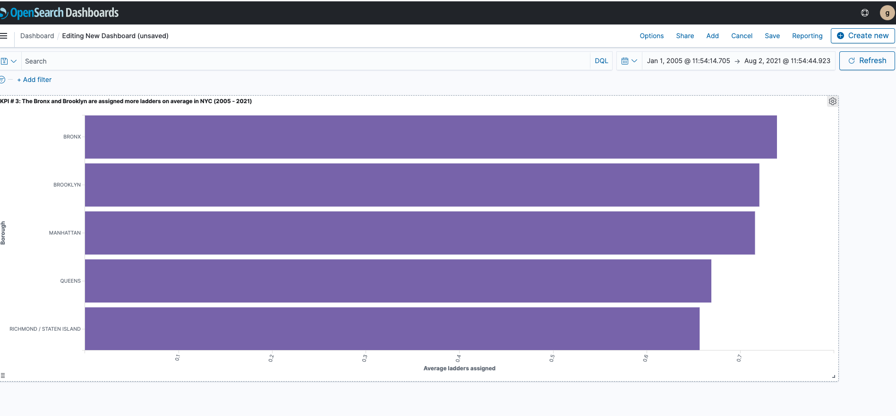
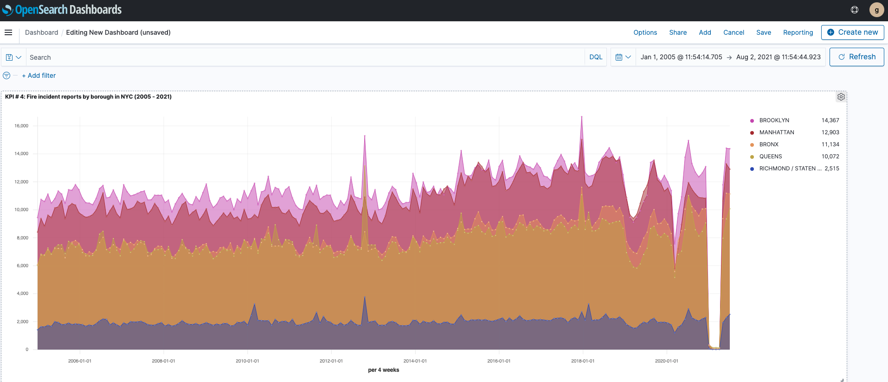
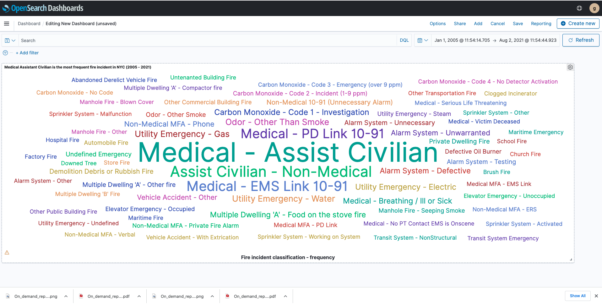
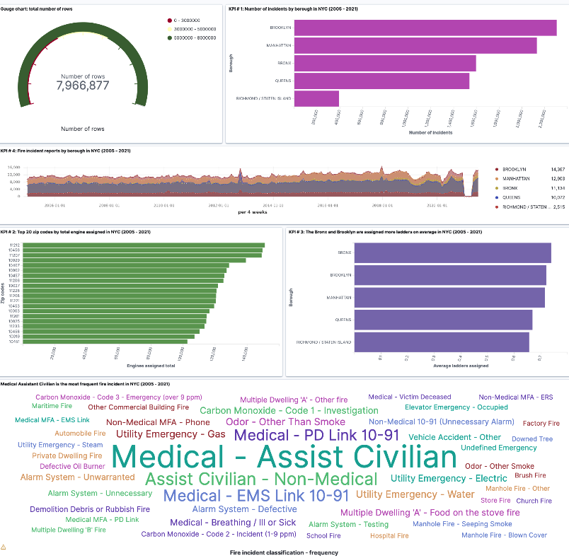

# Analyzing millions of NYC fire incident dispatch data with Big Data Technologies :books::mag: 

By Gabriel Fernandez <br>
Fall 2022 (Updated: Sept. 2023)

## Project bites :chocolate_bar:

**Brief**: In this project, I leveraged Big Data tools to manage a dataset that surpassed a single machine's capabilities and transform raw data into valuable insight.

**Key insights**: Investigate borough disparity, monitor zip code hotspots, explore the most frequent incident type further, and optimize resource planning for enhanced safety, property protection, and cost management.

**Tools**: EC2 (Elastic Compute Cloud), Docker, Python, Terminal, Socrata Open Data API, OpenSearch (NoSQL database), AWS Kibana.

**Concepts**: Infrastructure as a Service (IaaS), containerization, Python scripting, data retrieval via API, NoSQL database management, and data visualization with Kibana.


## Project objective :dart:

In this Big Data Technology project, I applied the concepts and tools I learned about Infrastructure as a Service (IaaS) with EC2, the terminal, containerization with Docker, and a NoSQL database like OpenSearch to handle a dataset that exceeded the capacity of a single machine. I also crafted a dashboard with Kibana to uncover insights from the data.


## Dataset

The [Fire Incident Dispatch Data](https://data.cityofnewyork.us/widgets/8m42-w767)
file originates from the Starfire Computer-Aided Dispatch System, tracking incidents from creation to closure. It details resource allocation and the Fire Department's response to emergencies while safeguarding personal information under HIPAA (Health Insurance Portability and Accountability Act) by aggregating incident locations.


NYC Open Data provides free datasets, including large ones. They offer an API for easy data retrieval. I use a Python client to fetch Fire Incident Dispatch Data from the API.

- [Data schema](https://dev.socrata.com/foundry/data.cityofnewyork.us/8m42-w767)
  
- Obtained an app [token]( https://data.cityofnewyork.us/login)

- Used [Socrata Open Data API](https://dev.socrata.com/)


## Questions and KPIs (Key Performance Indicators)

Next, I took a moment to think about important questions and suitable indicators to enhance my understanding and analysis of the data. This was a purposeful step to ensure that my data exploration remained relevant and meaningful.

### KPIs

- KPI # 1: Number of incidents by borough 
- KPI # 2: Total engine assigned by zip codes
- KPI # 3: Average ladders assigned by borough
- KPI # 4: Number of incidents by the borough over time
- World cloud: Frequency of incident by fire incident classification

### Questions
- Which borough has more fire incidents?
- Which five zip codes are assigned the total highest number of engines?
- Which are the top two boroughs by assigned ladders on average?
- What happened to fire incidents during the pandemic?
- Answer: If we look at KPI # 4: Fire incident reports by borough in NYC (2005 - 2021). 
- What is the most frequent classification of fire incidents?


| Field Name                | Data Type   | Field Description                                                           |
|---------------------------|-----------  |-----------------------------------------------------------------------------|
| starfire_incident_id      | number      | an incident identifier comprising the 5 character julian date, 4 character alarm box number, 2 character number of incidents at the box so far for the day, 1 character borough code , 4 character sequence number.|
| incident_datetime         | datetime    | The date and time of the incident.                                           |
| incident_borough          | text        | The borough of the incident.                                                 |
| zipcode                   | text        | The zip code of the incident.                                                |
| incident_classification   | text        | The incident classification.                                                 |
| engines_assigned_quantity | number      | The number of engine units assigned to the incident.                         |
| ladders_assigned_quantity | number      | The number of ladder units assigned to the incident.                         |


## Project workflow


###  Tools

- **EC2 (Elastic Compute Cloud)**: A scalable cloud computing service by AWS for launching virtual servers.
- **Docke**r: A platform for developing, shipping, and running applications in containers.
- **Socrata Open Data API**: Web service for accessing and manipulating datasets.
- **OpenSearch (NoSQL database)**: A search and analytics engine for handling large volumes of data, an open-source alternative to Elasticsearch.
- **AWS Kibana**: A data visualization and exploration tool used for analyzing data stored in OpenSearch or Elasticsearch.

**Big data infrastructure configuration**

- Amazon OpenSearch cluster where the instance type is r6g.large.search, availability zone is 3-AZ, and the number of nodes is 3.
- Amazon EC2 t2.xlarge instance type with 30 (GiB) of EBS and 16 (Gib) of Mem.


After setting up an EC2 instance on AWS, I developed a Python script within Docker to retrieve data from the NYC Open Data via their API and transmit it to OpenSearch. I ensured the data bypassed my EC2 instance and was directly streamed to OpenSearch. Once the data was accessible in OpenSearch, I generated multiple AWS Kibana to create a dashboard to explore the data and uncover insights.

### Docker

```shell

Build docker image
docker build -t project01:1.0 .
```
- [See Docker file](Dockerfile) 
- [See requirement file](requirements.txt)


### Python scripting

I wrote a Python command-line interface that connected to the Fire Incident Dispatch Data. My script was designed to run within Docker and accepted command-line parameters. Each data line processed by my script was accurately passed into OpenSearch. I had the freedom to choose which API fields to push into OpenSearch.

**Data colelction time**




-  1 hour and 45 minutes

- The minimum requirement was collecting 100,000 rows, but I collected almost 8 million.

### User interphase

In this project, I was required to use environment variables to configure and run a Python script via the command-line interface (CLI). By setting these variables, I securely managed important configuration details such as API tokens and OpenSearch cluster information, ensuring safe and flexible execution of the script.


#### Option A

The script fetches and uploads data in batches defined by page_size multiplied by num_pages, excluding null values and instances where starfire_incident_id and incident_datetime are null.

```shell

docker run \
-e DATASET_ID="8m42-w767" \
-e APP_TOKEN="your_key" \
-e ES_HOST="your_opensearch_domain" \
-e ES_USERNAME="your_openseact_user_name" \
-e ES_PASSWORD="_your_opensearch_password" \
-e INDEX_NAME="fireincident" \
project01:1.0 --page_size=100 --num_pages=5

```

#### Option B

When num_pages is not specified, the script uploads the entire dataset in chunks of size determined by num_pages, excluding null values and cases where starfire_incident_id and incident_datetime are null.


```shell

docker run \
-e DATASET_ID="8m42-w767" \
-e APP_TOKEN="your_key" \
-e ES_HOST="your_opensearch_domain" \
-e ES_USERNAME="your_openseact_user_name" \
-e ES_PASSWORD="_your_opensearch_password" \
-e INDEX_NAME="fireincident" \
project01:1.0 --page_size=50000


```


### Project composition

- +-- Dockerfile
- +-- requirements.txt
- +-- src/
- +-- +-- main.py
- +-- assets/
- +-- +-- Gauge_chart_total_number_of_rows.png
- +-- +-- KPI_1_Number_of_incidents_by_borough_in_NYC_2005_2021.png
- +-- +-- KPI_2_Top_20_zip_codes_by_total_engine_assigned_in_NYC_2005_2021.png
- +-- +-- KPI_3_The_Bronx_and_Brooklyn_are_assigned_more_ladders_on_average_in_NYC_2005_2021.png
- +-- +--KPI_4_Fire_incident_reports_by_borough_in_NYC_2005_2021.png
- +-- +-- Medical_Assistant_Civilian_is_the_most_frequent_fire_incident_in_NYC_2005_2021.png
- +-- +-- Dashboard_with_all_visualizations.png
- - +-- +-- Dashboard_with_all_visualizations.png
- +-- README.pd


## Exploratory Visualizations


### Gauge chart showing the total number of rows collected



#### Observations: 

- I collected 7,966,877 incidents.
  
- The minimum requirement was to collect 100,000 rows, but I collected almost 8 million rows.

  
<br>
<br>


### KPI 1: Number of incidents by borough in NYC (2005-2021)




#### Observations: 

- Brooklyn experiences a higher number of fire incidents compared to other boroughs.

<br>
<br>


### KPI 2: Top 20 NYC zip codes by total engine assignments (2005-2021)




#### Observations: 

- The top five zip codes with the highest number of engine assignments are 11212, 10456, 11207, 10029, and 10467.

<br>
<br>


### KPI 3: Top boroughs for average ladder assignments in NYC (2005-2021)



#### Observations:

- The Bronx and Brooklyn are the top two boroughs with the highest average ladder assignments.

<br>
<br>

### KPI 4: Fire incident reports by borough in NYC (2005-2021)



#### Observations:

- It appears that the number of incidents decreased during the pandemic. However, such an extreme decline across all boroughs is better explained by missing data.During the pandemic, numerous public services were disrupted as a result.


### In our data: "Medical-Assist  Civilian" is the most frequent incident in NYC (2005-2021)




#### Observations:

- The most frequent classification of fire incidents in NYC is "Medical - Assist Civilian."

- The frequency of this category might be related to the pandemic, but further investigation is needed for confirmation.

<br>
<br>


### Putting all visualizations together

 

[Click here to see a PDF version](assets/Dashboard_with_all_visualizations.pdf)


## Key insights and recommendations :bulb:

- Brooklyn reports consistently higher fire incidents. Investigate the reasons behind this disparity and allocate additional resources for targeted prevention and response in high-incidence areas.

-  Periodically monitor zip code hotspots, which may require additional resources and attention to address fire-related challenges. Continuously optimize resource allocation for these areas.

- Look into the increase in 'Medical - Assist Civilian' incidents with greater detail to determine any potential links to the pandemic and, if required, implement suitable actions.


- High ladder assignments in The Bronx and Brooklyn could benefit from optimizing resource planning to save lives, protect property, and manage costs effectively.


### Lessons learned :sparkles:


- Scalable computing allows for efficient and flexible handling of large data volumes.

- Docker ensures reproducibility by enabling consistent application execution across diverse environments.

- AWS offers an end-to-end solution that covers everything from extracting data to visualizing it. Other cloud services have equivalent tools.

- Understanding and utilizing Command-Line Interface (CLI) tools is important for efficiently managing cloud services and resources.

- From my experience, testing a simplified project in Jupyter Lab with a small data sample before deploying on EC2 was helpful. It helps catch potential issues early.

- Cloud computing, like a buffet, is cost-effective until you forget to stop eating when you are full! Remember to terminate your resources after you are done with your work. :warning:


## References 

- Hands-on Exercise: Analyzing 311 Service Requests with OpenSearch (Successor to Elasticsearch) by Ecem Basak

- [Monitoring Application KPIs Using Structured Logging with Elasticsearch & Kibana](https://medium.com/@stavsofer/monitoring-application-kpi-structured-logging-elasticsearch-kibana-212183c7bbdf) 

- [Queries using SODA](https://dev.socrata.com/docs/queries/)
  
- [Paging through data](https://dev.socrata.com/docs/paging.html#2.1)

- [Kibana doesn't show any results in "Discover"](https://stackoverflow.com/a/30781202/15333580)
  


